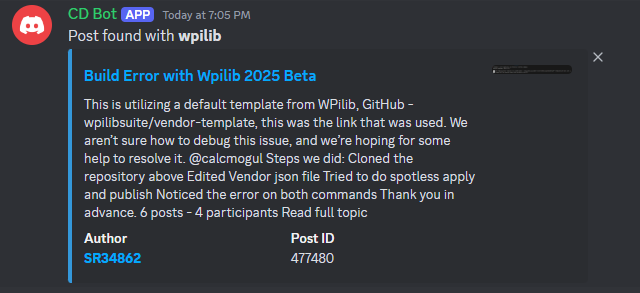

# CD Discord Bot
> A discord bot that fetches post on [Chief Delphi](https://chiefdelphi.com) based on certain keywords

| Images | Images|
| ------ | ----- |
|  |  |

## Self-Host
1. Clone this repo
2. Install requirements: `pip install -r requirements.txt`
3. Rename `config.example.json` to `config.json` and change your bot token, channel id, and keywords/authors
5. Run the bot `python -m bot`